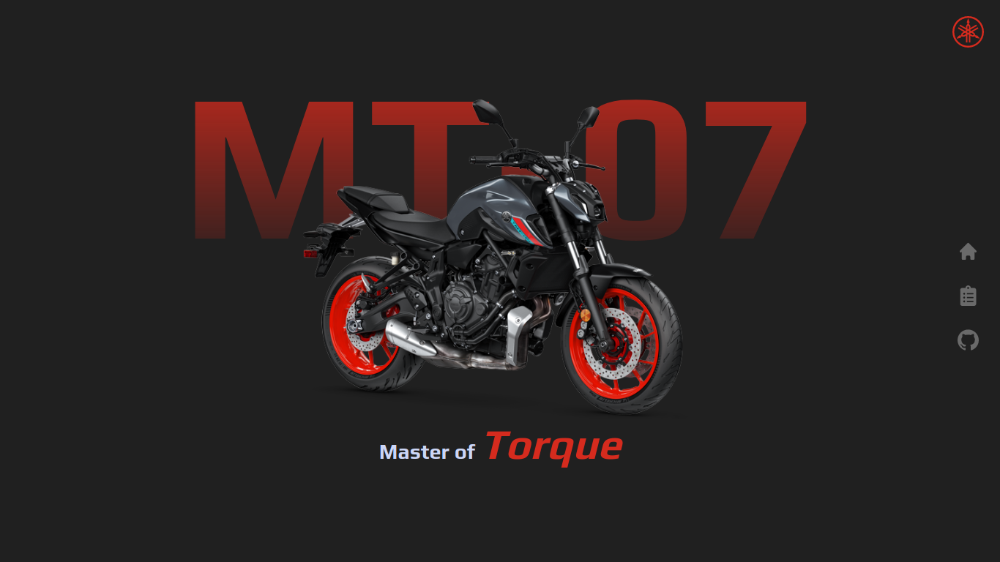

<p>
  
  
  
  <a href="https://opensource.org/licenses/MIT">
    
  </a>
</p>

<p align="center">
  
</p>

## Sobre

Landing page da motocicleta [Yamaha MT-07](https://www3.yamaha-motor.com.br/mt-07-abs/product/30012), construída utilizando o framework Next.js e animações com CSS puro.

<br>

## Tecnologias

Tecnologias e ferramentas utilizadas no desenvolvimento do projeto:

- [React](https://reactjs.org/)
- [Next.js](https://nextjs.org/)
- [TypeScript](https://www.typescriptlang.org/)
- [Styled Components](https://styled-components.com/)
- [React Icons](https://react-icons.github.io/react-icons/)
- [VS Code](https://code.visualstudio.com/) com [ESLint](https://eslint.org/), [Prettier](https://prettier.io/) e [EditorConfig](https://editorconfig.org/)
<br>

## Instalação e uso

```bash
# Abra um terminal e copie este repositório com o comando
git clone https://github.com/martins-rafael/mt07-landing-page.git
# ou use a opção de download.

# Entre na pasta com
cd mt07-landing-page

# Instale as dependências
yarn install

# Rode a aplicação
yarn dev

# Acesse http://localhost:3000 no seu navagador.
```

<br>


## Licença
<a href="https://opensource.org/licenses/MIT">
    
</a>

<br>

Esse projeto está sob a licença MIT. Veja o arquivo [LICENSE](/LICENSE) para mais detalhes.

---

Feito com :heart: by [Rafael Martins](https://github.com/martins-rafael)

[](https://www.linkedin.com/in/rafaeldcmartins/)
[](mailto:rafaeldcmartins@gmail.com)
